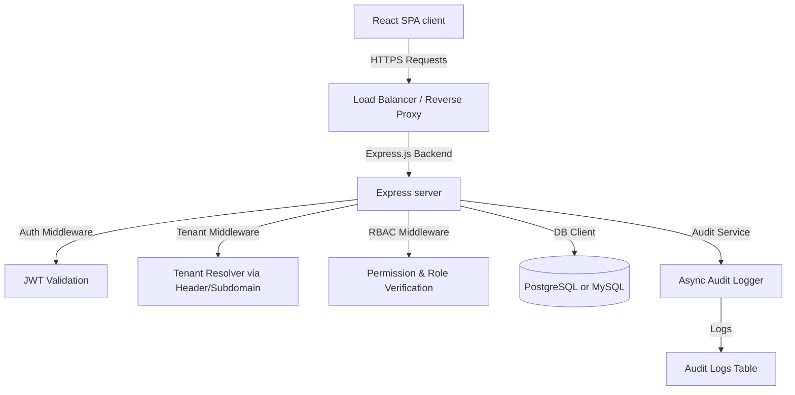

# Multi-Tenant RBAC System Architecture Plan

This document details the system design, database schemas, and folder structures for a production-ready Multi-Tenant Role-Based Access Control (RBAC) system. The project features an Express.js backend supporting both PostgreSQL and MySQL/MariaDB (XAMPP-ready) via a unified query engine, and a React dashboard using Tailwind CSS.

---

## 1. System Architecture



### Core Architecture Components

1. **Multi-Tenancy (Shared Database, Shared Schema)**
   - **Isolation**: Each tenant has a unique `tenant_id` (UUID). All tenant-specific tables contain a `tenant_id` column with an index.
   - **Resolution**: Public API requests resolve the tenant by slug (e.g. `/api/auth/login` sends the tenant slug). Authenticated requests resolve tenant context from the verified JWT payload (`req.user.tenantId`).
   - **Safety**: A database wrapper automatically applies `tenant_id` filtering to prevent cross-tenant data leakage.

2. **Dynamic RBAC (Role-Based Access Control)**
   - **Roles**: Belongs to a tenant. When a tenant is created, default roles (`Owner`, `Admin`, `Member`, `Viewer`) are automatically seeded. Owners/Admins can create custom roles dynamically.
   - **Permissions**: Defined system-wide as static actions (e.g., `users:create`, `roles:update`, `audit:read`).
   - **Mappings**: Roles map to Permissions (many-to-many), and Users map to Roles (many-to-many).
   - **Dynamic Enforcement**: When a user logs in, their permissions are compiled and returned in their JWT. A middleware checks if the user possesses the required permission.

3. **Audit & Logging System**
   - Logs key security and business events (logins, CRUD actions on users, role modifications, settings updates).
   - Non-blocking (async) logging to prevent API response delays.
   - Captures actor details, IP addresses, user-agents, actions, timestamps, and resource diffs (metadata).

---

## 2. Database Schema Design

We support two SQL flavors to meet all requirements:
1. **PostgreSQL Schema** (production-grade with native UUID support).
2. **MySQL / XAMPP Schema** (MariaDB compatible, using VARCHAR(36) for UUIDs).

### PostgreSQL Schema DDL

```sql
-- Create UUID extension
CREATE EXTENSION IF NOT EXISTS "uuid-ossp";

-- 1. Tenants Table
CREATE TABLE tenants (
    id UUID PRIMARY KEY DEFAULT uuid_generate_v4(),
    name VARCHAR(255) NOT NULL,
    slug VARCHAR(100) UNIQUE NOT NULL,
    status VARCHAR(50) NOT NULL DEFAULT 'active', -- active, suspended
    created_at TIMESTAMP WITH TIME ZONE DEFAULT CURRENT_TIMESTAMP,
    updated_at TIMESTAMP WITH TIME ZONE DEFAULT CURRENT_TIMESTAMP
);
CREATE INDEX idx_tenants_slug ON tenants(slug);

-- 2. Users Table
CREATE TABLE users (
    id UUID PRIMARY KEY DEFAULT uuid_generate_v4(),
    tenant_id UUID NOT NULL REFERENCES tenants(id) ON DELETE CASCADE,
    email VARCHAR(255) NOT NULL,
    password_hash VARCHAR(255) NOT NULL,
    name VARCHAR(255) NOT NULL,
    status VARCHAR(50) NOT NULL DEFAULT 'active', -- active, suspended, invited
    created_at TIMESTAMP WITH TIME ZONE DEFAULT CURRENT_TIMESTAMP,
    updated_at TIMESTAMP WITH TIME ZONE DEFAULT CURRENT_TIMESTAMP,
    CONSTRAINT uq_tenant_email UNIQUE(tenant_id, email)
);
CREATE INDEX idx_users_tenant ON users(tenant_id);
CREATE INDEX idx_users_email ON users(email);

-- 3. Permissions Table (Global Static Registry)
CREATE TABLE permissions (
    id VARCHAR(100) PRIMARY KEY, -- e.g., 'users:create', 'roles:write'
    name VARCHAR(255) NOT NULL,
    description TEXT,
    module VARCHAR(100) NOT NULL -- Users, Roles, Tenant, Audit
);

-- 4. Roles Table
CREATE TABLE roles (
    id UUID PRIMARY KEY DEFAULT uuid_generate_v4(),
    tenant_id UUID NOT NULL REFERENCES tenants(id) ON DELETE CASCADE,
    name VARCHAR(100) NOT NULL,
    description TEXT,
    is_system BOOLEAN DEFAULT FALSE, -- owner, admin, etc.
    created_at TIMESTAMP WITH TIME ZONE DEFAULT CURRENT_TIMESTAMP,
    updated_at TIMESTAMP WITH TIME ZONE DEFAULT CURRENT_TIMESTAMP,
    CONSTRAINT uq_tenant_role UNIQUE(tenant_id, name)
);
CREATE INDEX idx_roles_tenant ON roles(tenant_id);

-- 5. Role Permissions (Many-to-Many)
CREATE TABLE role_permissions (
    role_id UUID NOT NULL REFERENCES roles(id) ON DELETE CASCADE,
    permission_id VARCHAR(100) NOT NULL REFERENCES permissions(id) ON DELETE CASCADE,
    PRIMARY KEY (role_id, permission_id)
);

-- 6. User Roles (Many-to-Many)
CREATE TABLE user_roles (
    user_id UUID NOT NULL REFERENCES users(id) ON DELETE CASCADE,
    role_id UUID NOT NULL REFERENCES roles(id) ON DELETE CASCADE,
    PRIMARY KEY (user_id, role_id)
);

-- 7. Audit Logs Table
CREATE TABLE audit_logs (
    id UUID PRIMARY KEY DEFAULT uuid_generate_v4(),
    tenant_id UUID NOT NULL REFERENCES tenants(id) ON DELETE CASCADE,
    user_id UUID REFERENCES users(id) ON DELETE SET NULL,
    user_email VARCHAR(255), -- Keep email in case user is deleted
    action VARCHAR(100) NOT NULL, -- e.g., 'auth.login', 'user.create'
    resource VARCHAR(100) NOT NULL, -- e.g., 'users', 'roles'
    resource_id VARCHAR(100),
    status VARCHAR(50) NOT NULL, -- success, failure
    ip_address VARCHAR(45) NOT NULL,
    user_agent TEXT,
    payload JSONB, -- stores details like changed fields, reasons
    created_at TIMESTAMP WITH TIME ZONE DEFAULT CURRENT_TIMESTAMP
);
CREATE INDEX idx_audit_logs_tenant ON audit_logs(tenant_id);
CREATE INDEX idx_audit_logs_action ON audit_logs(action);
CREATE INDEX idx_audit_logs_created_at ON audit_logs(created_at);
```

### MySQL / XAMPP Schema DDL

```sql
-- 1. Tenants Table
CREATE TABLE tenants (
    id VARCHAR(36) PRIMARY KEY,
    name VARCHAR(255) NOT NULL,
    slug VARCHAR(100) UNIQUE NOT NULL,
    status VARCHAR(50) NOT NULL DEFAULT 'active',
    created_at TIMESTAMP DEFAULT CURRENT_TIMESTAMP,
    updated_at TIMESTAMP DEFAULT CURRENT_TIMESTAMP ON UPDATE CURRENT_TIMESTAMP,
    INDEX idx_tenants_slug (slug)
) ENGINE=InnoDB DEFAULT CHARSET=utf8mb4;

-- 2. Users Table
CREATE TABLE users (
    id VARCHAR(36) PRIMARY KEY,
    tenant_id VARCHAR(36) NOT NULL,
    email VARCHAR(255) NOT NULL,
    password_hash VARCHAR(255) NOT NULL,
    name VARCHAR(255) NOT NULL,
    status VARCHAR(50) NOT NULL DEFAULT 'active',
    created_at TIMESTAMP DEFAULT CURRENT_TIMESTAMP,
    updated_at TIMESTAMP DEFAULT CURRENT_TIMESTAMP ON UPDATE CURRENT_TIMESTAMP,
    UNIQUE KEY uq_tenant_email (tenant_id, email),
    INDEX idx_users_tenant (tenant_id),
    INDEX idx_users_email (email),
    FOREIGN KEY (tenant_id) REFERENCES tenants(id) ON DELETE CASCADE
) ENGINE=InnoDB DEFAULT CHARSET=utf8mb4;

-- 3. Permissions Table
CREATE TABLE permissions (
    id VARCHAR(100) PRIMARY KEY,
    name VARCHAR(255) NOT NULL,
    description TEXT,
    module VARCHAR(100) NOT NULL
) ENGINE=InnoDB DEFAULT CHARSET=utf8mb4;

-- 4. Roles Table
CREATE TABLE roles (
    id VARCHAR(36) PRIMARY KEY,
    tenant_id VARCHAR(36) NOT NULL,
    name VARCHAR(100) NOT NULL,
    description TEXT,
    is_system TINYINT(1) DEFAULT 0,
    created_at TIMESTAMP DEFAULT CURRENT_TIMESTAMP,
    updated_at TIMESTAMP DEFAULT CURRENT_TIMESTAMP ON UPDATE CURRENT_TIMESTAMP,
    UNIQUE KEY uq_tenant_role (tenant_id, name),
    INDEX idx_roles_tenant (tenant_id),
    FOREIGN KEY (tenant_id) REFERENCES tenants(id) ON DELETE CASCADE
) ENGINE=InnoDB DEFAULT CHARSET=utf8mb4;

-- 5. Role Permissions
CREATE TABLE role_permissions (
    role_id VARCHAR(36) NOT NULL,
    permission_id VARCHAR(100) NOT NULL,
    PRIMARY KEY (role_id, permission_id),
    FOREIGN KEY (role_id) REFERENCES roles(id) ON DELETE CASCADE,
    FOREIGN KEY (permission_id) REFERENCES permissions(id) ON DELETE CASCADE
) ENGINE=InnoDB DEFAULT CHARSET=utf8mb4;

-- 6. User Roles
CREATE TABLE user_roles (
    user_id VARCHAR(36) NOT NULL,
    role_id VARCHAR(36) NOT NULL,
    PRIMARY KEY (user_id, role_id),
    FOREIGN KEY (user_id) REFERENCES users(id) ON DELETE CASCADE,
    FOREIGN KEY (role_id) REFERENCES roles(id) ON DELETE CASCADE
) ENGINE=InnoDB DEFAULT CHARSET=utf8mb4;

-- 7. Audit Logs Table
CREATE TABLE audit_logs (
    id VARCHAR(36) PRIMARY KEY,
    tenant_id VARCHAR(36) NOT NULL,
    user_id VARCHAR(36) NULL,
    user_email VARCHAR(255) NULL,
    action VARCHAR(100) NOT NULL,
    resource VARCHAR(100) NOT NULL,
    resource_id VARCHAR(100) NULL,
    status VARCHAR(50) NOT NULL,
    ip_address VARCHAR(45) NOT NULL,
    user_agent TEXT NULL,
    payload JSON NULL,
    created_at TIMESTAMP DEFAULT CURRENT_TIMESTAMP,
    INDEX idx_audit_logs_tenant (tenant_id),
    INDEX idx_audit_logs_action (action),
    INDEX idx_audit_logs_created_at (created_at),
    FOREIGN KEY (tenant_id) REFERENCES tenants(id) ON DELETE CASCADE,
    FOREIGN KEY (user_id) REFERENCES users(id) ON DELETE SET NULL
) ENGINE=InnoDB DEFAULT CHARSET=utf8mb4;
```

---

## 3. Directory Structure

```text
rbac-system/
├── backend/
│   ├── src/
│   │   ├── config/             # DB & server configs (Knex config)
│   │   ├── controllers/        # Express handlers (auth, users, roles, audit)
│   │   ├── db/                 # DB Client wrapper (multi-tenant helper)
│   │   ├── middleware/         # Auth, Tenant context, RBAC validation
│   │   ├── routes/             # API Router definitions
│   │   ├── services/           # Audit logging service & token service
│   │   └── app.js              # Server entry point
│   ├── .env.example            # Sample configuration settings
│   ├── package.json            # Node backend manifest
│   └── knexfile.js             # Knex migration & DB details
│
├── frontend/
│   ├── src/
│   │   ├── assets/             # Images and design resources
│   │   ├── components/         # Shared components (Sidebar, Card, Tables, Modal, Inputs)
│   │   ├── context/            # AuthContext, TenantContext
│   │   ├── hooks/              # Custom React hooks (usePermissions, etc.)
│   │   ├── pages/              # Views (Dashboard, Users, Roles, Logs, Login, Register)
│   │   ├── services/           # Axios wrapper api.js
│   │   ├── App.jsx             # Main routing and UI wrapper
│   │   ├── index.css           # Global custom typography & Tailwind CSS
│   │   └── main.jsx            # React root mount
│   ├── index.html
│   ├── tailwind.config.js      # Custom theme setup
│   ├── vite.config.js          # Vite configuration
│   └── package.json            # React frontend manifest
```

---

## 4. API Endpoints Spec

| Method | Endpoint | Description | Auth Required | Permissions Required |
| :--- | :--- | :--- | :--- | :--- |
| **POST** | `/api/auth/register` | Register new Tenant + Admin user | No | *None* |
| **POST** | `/api/auth/login` | Authenticate user, returns JWT | No | *None* |
| **GET** | `/api/auth/me` | Retrieve profile and active session | Yes | *None* |
| **GET** | `/api/users` | List tenant users | Yes | `users:read` |
| **POST** | `/api/users` | Create user and assign roles | Yes | `users:create` |
| **PUT** | `/api/users/:id` | Update user status / details / roles | Yes | `users:update` |
| **DELETE** | `/api/users/:id` | Delete user | Yes | `users:delete` |
| **GET** | `/api/roles` | List all tenant roles with permissions | Yes | `roles:read` |
| **POST** | `/api/roles` | Create new tenant role with permissions| Yes | `roles:create` |
| **PUT** | `/api/roles/:id` | Update tenant role and permissions | Yes | `roles:update` |
| **DELETE** | `/api/roles/:id` | Delete custom role | Yes | `roles:delete` |
| **GET** | `/api/permissions` | Get global list of system permissions | Yes | `roles:read` |
| **GET** | `/api/audit-logs` | List tenant audit logs (with filters) | Yes | `audit:read` |

---

## 5. Security & Isolation Controls

1. **Password Hashing**: Stored using `bcrypt` (10 rounds).
2. **Access Tokens**: Short-lived JWTs (15m expiry) and Refresh Tokens stored securely.
3. **Database Guardrails**:
   - Every read query to a tenant table is appended with `.where('tenant_id', tenantId)`.
   - On writes (insert/update), `tenant_id` is programmatically overwritten from the JWT token state, blocking tampering.
4. **CORS & Security Headers**: Integrated `helmet` and standard security headers.
